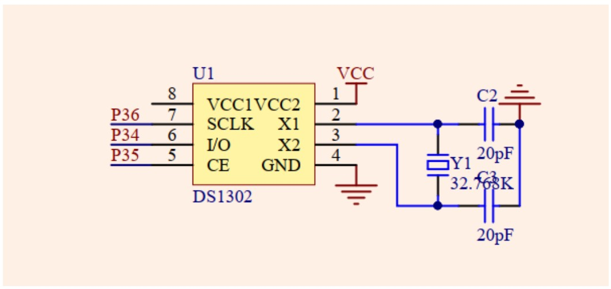
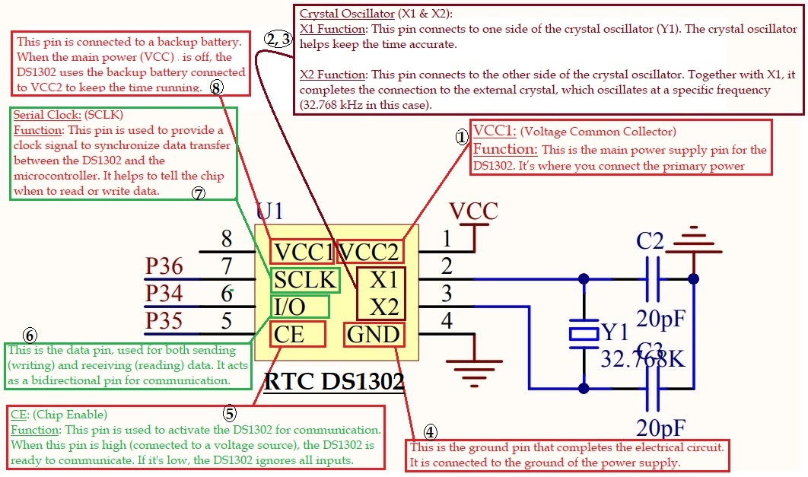

# TASK_16--DS1302-RTC-interfacing

## Task 16 : DS1302 RTC interfacing

1. Study the datasheet of RTC DS1302

https://datasheets.maximintegrated.com/en/ds/DS1302.pdf
3. Write a driver for DS1302 to read and write data/time. 
4. Read time from DS1302 after every one second and display on 16x2 LCD. 
5. Set time on the RTC from PC using Hercules software + serial port.
6. Create DS1302.h and DS1302.c files and organize all the RTC functions and code inside 
them.
